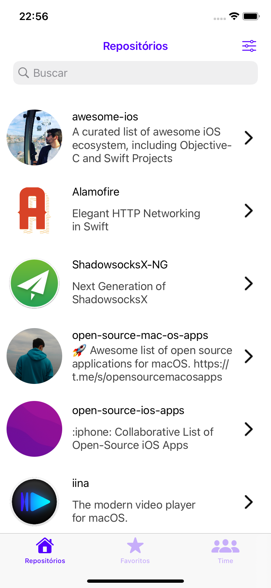
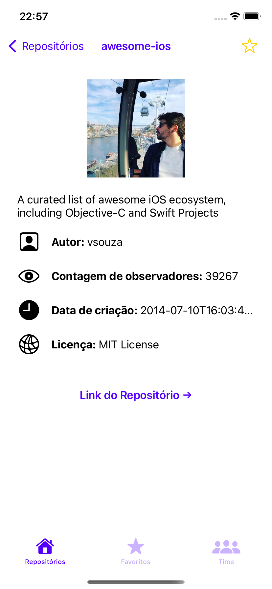
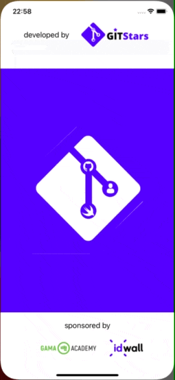

<!-- PROJECT LOGO -->

    <h1> Projeto final Desafio Go!dev: GitStars </h1>

 

    

  <h3 align="center">O aplicativo com seus repositórios favoritos!</h3>
    <h4> Projeto desenvolvido ao longo do bootcamp oferecido pela parecia da idwall com a Gama Academy </h4>
 
 
  

    
    
    
  

&nbsp;

<!-- TABLE OF CONTENTS -->

  <h1>
Sumário
</h1>
  <ol>
    <li><a href="#about-the-project">About The Project</a></li>
    <li><a href="#built-with">Built With</a></li>
    <li><a href="#usage">Usage</a></li>
    <li><a href="#license">License</a></li>
    <li><a href="#contact">Contact</a></li>
  </ol>

<!-- ABOUT THE PROJECT -->

 

## 📝 Sobre o projeto

O GitStars é um aplicativo que permite que você pesquise repositórios por linguagem de programação ordenando pela quantidade de estrelas que aquele repositório possui. Além disso, você pode favoritar os repositórios que mais gostar, e visualizar posteriormente em uma lista. É necessário ao menos o `iOS 13` para rodar o projeto, e não existe versão para iPad

(<a href="#top">back to top</a>)

 

### 🔨 Desenvolvido com

O aplicativo é nativo para iOS e foi desenvolvido com `Swift`, sendo utilizado:
* `UIKit`
* Arquitetura `MVVM`
* Design Systems
* Coordinator pattern
* pod [KingFisher](https://cocoapods.org/pods/Kingfisher) para carregamento de imagens
* Requisições à URL nativas com `URLSession`

(<a href="#top">back to top</a>)

<!-- USAGE EXAMPLES -->
## 📲 Utilização

Alguns gifs demonstrando a utilização da aplicação, visualizando repositórios da linguagem Swift e adicionando aos favoritos 

  
  

(<a href="#top">back to top</a>)

 

<!-- CONTRIBUTING -->
## 👨🏻‍💻👩🏻‍💻 Desenvolvedores

1. Larissa Cristina da Silva Monteiro
2. Bruno Barros Coelho
3. William Daniel da Silva
4. Jady Linnit Alves da Silva Linnit
5. Matheus Lenke Coutinho

(<a href="#top">back to top</a>)

 

<!-- LICENSE -->
## 🔐 License

Distributed under the MIT License. See `LICENSE.txt` for more information.

(<a href="#top">back to top</a>)
